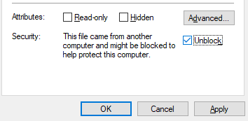
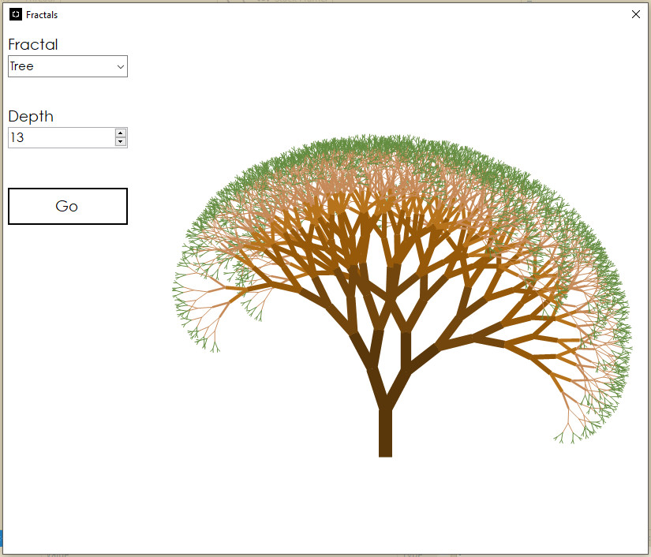

# FractalGenerator

An application that demonstrates a handful of fractal images generated by recursive algorithms, as written for IN711 Algorithms and Data Structures, semester 2, 2017.

Written in C# using Visual Studio 2015.
  

### Build

<a href="https://github.com/kellybs1/FractalGenerator/blob/master/Builds/Fractals.exe?raw=true">/Builds/Fractals.exe</a>

Note: You may need to unblock the executable: Right click the exe -> Properties, and in the bottom section click the Unblock checkbox and then click OK.

### Source

<a href="https://github.com/kellybs1/FractalGenerator/tree/master/kellybs1Fractals">/kellybs1Fractals</a>

### Screenshot

### Notes
Contains bugs: An educational project only    
Single-threaded: application. Choosing large depth can be a long wait for responsiveness.  
